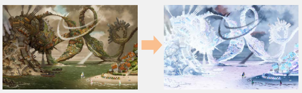
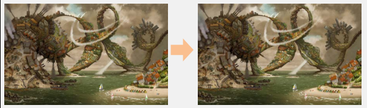
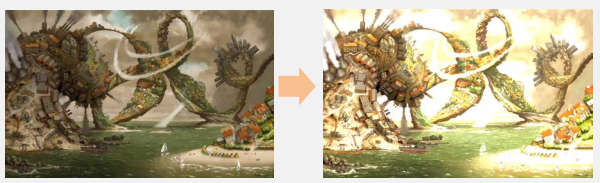

# PPM-Image-Filtering

This project was completed for the C++ course of the [Department of Computer Science of the Athens University of Economics and Business](https://www.dept.aueb.gr/el/cs), during the Fall semester of 2019-2020.

The objective of this assignment was to create an image-filtering application in C++. Image format must be [PPM](http://paulbourke.net/dataformats/ppm/), P6 version. Polymorphism, Inheritance and Templates were used.

## Useful Reads

For a full overview it is highly suggested that you read:

- [Project Assignment](assignment/CPP2019_Assignment.pdf), that contains all the details about how the image filtering and all the concepts mentioned above must be implemented.

## Environment

- [Visual Studio 2019](https://visualstudio.microsoft.com/vs/)
- [GIMP](https://www.gimp.org/), to view all .ppm files.

## Usage

### <ins>Setup</ins>

1. **Clone** repository,

   ```console
   git clone https://github.com/nevwalkalone/PPM-Image-Filtering.git
   ```

2. **Open** ppm_filter.sln in Visual Studio 2019,
3. **Build** both ppm and test projects,
4. **Set** test project as the Startup Project.
5. **Place** the image you want to filter, inside the test folder.

### <ins>Filtering</ins>

- There are 2 available filters, **linear** and **gamma**. For more details about these 2 filters check the assignment. Gamma filter takes 1 parameter, while linear takes 6.

- The filter we want to apply (with its parameters), as well as the name of the Image, must be given as command arguments in test project, **Properties>Configuration Properties>Debugging>Command Arguments**.

- After specifying the filters you want to apply and the name of the image in the command arguments section, **Run the application**.

- The filtered image will be created inside the test folder, called "filtered\_ <image_name>.ppm".

## Filter Examples

In the examples pictured below, these [images](https://drive.google.com/file/d/1SxqzgI6JMyyR08FwlrOOSCOoM13CMs0H/view?usp=sharing) were used.

1. Combination of gamma and linear filters that produce a color negative.

   ```console
   > filter -f gamma 2.0 -f linear -1 -1 -1 1 1 1 Image01.ppm
   ```

   

2. Consecutive gamma filters that cancel each other.

   ```console
   > filter -f gamma 2.0 -f gamma 0.5 Image01.ppm
   ```

   

3. Doubles the brightness.

   ```console
   > filter -f linear 2 2 2 0 0 0 Image01.ppm
   ```

   

4. Applies 3 filters that alter the colors of the image.

   ```console
   > filter -f gamma 0.7 -f linear 1 0.8 0.3 0.1 0.1 0.3 -f gamma 1.2 Image02.ppm
   ```

   
